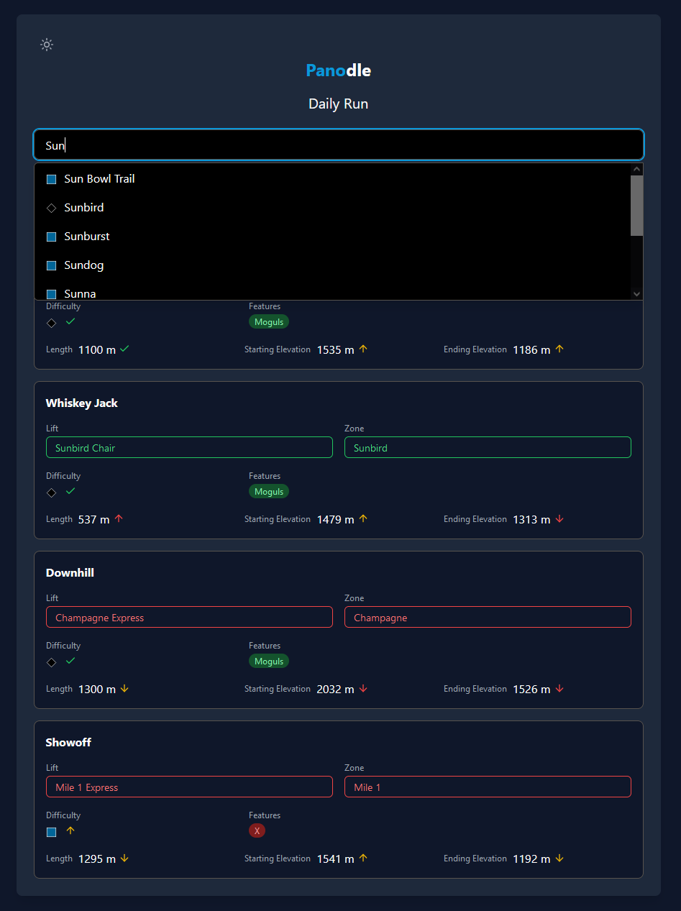

# Panodle

A Wordle-style game for guessing ski runs at Panorama Mountain Resort. Try to guess the daily run by comparing lift locations, zones, difficulty levels, features, and elevations.



## How to Play

1. Visit [panodle.virtualized.dev](https://panodle.virtualized.dev)
2. Type in the name of any ski run at Panorama Mountain Resort
3. Submit your guess
4. Review the feedback:
   - Green indicators show exact matches
   - Yellow indicators show partial matches or directional hints
   - Red indicators show mismatches
5. Use the feedback to make a better guess
6. Try to guess the run in 15 attempts or less

## Technical Details

Built with:

- React
- Tailwind CSS
- react-cookie for state management
- Lucide React for icons
- Recharts for statistics visualization
- Supabase for authentication and database management
- Google Cloud for authentication flow

## Contributing

1. Fork the repository
2. Create a feature branch:

```bash
git checkout -b feature/amazing-feature
```

3. Commit your changes:

```bash
git commit -m 'Add some amazing feature'
```

4. Push to the branch:

```bash
git push origin feature/amazing-feature
```

5. Open a Pull Request

## License

This project is licensed under the GNU General Public License - see the [LICENSE.md](LICENSE.md) file for details

## Acknowledgments

- Inspired by Wordle and other Wordle-like games
- Run data provided by Jollyturns
- Icons by Lucide

## Contact

Connor Mills - [@v_rtualized](https://x.com/v_rtualized)

Project Link: [https://github.com/V-rtualized/panodle](https://github.com/V-rtualized/panodle)
